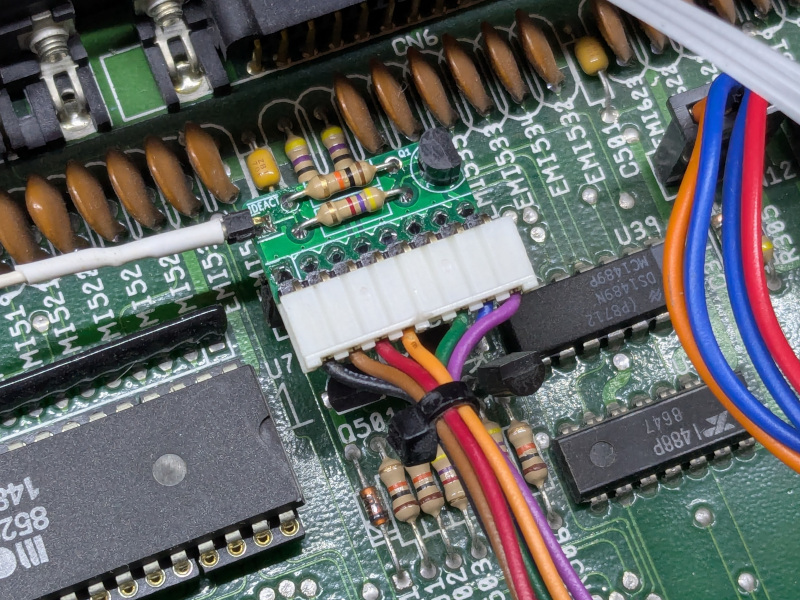

# A500 IDE activity led injector

## DISCLAIMER

Any use of this project is **under your own responsibility**.
You will be responsible of checking the correct construction and functionality of your board.
By using this project You will agree that I cannot be held responsible if it will destroy any of your devices, damage your computer, burn down your house or whatever.

## Introduction

This board reproduces the same circuit that the A500 uses to flash the "DRIVE" LED when the `/MTR0` signal is toggled, and puts itself in parallel to that 
by being installed between the keyboard and the connector on the motherboard.

It is useful to have the LED blink for other activity beside the floppy's, ideally, IDE hard drive activity.

The IDE activity signal must then be taken from the IDE connector, on a 44 pin connector, it is on pin 39.

### Ordering the boards

You can order the board for this project at [PCBWay](https://www.pcbway.com/project/shareproject/A500_IDE_LED_mod_board_fed31fc6.html) and support me or download 
the gerbers and have them printed wherever you like!!!

## Hardware

The board was designed with [KiCad](https://kicad.org/) EDA.

### Bill of Materials

| Component              | Qty | Type / Value                     | Notes                                                                |
| ---------------------- | --- | -------------------------------- | -------------------------------------------------------------------- |
| R1                     |  1  | 4.7K 1/4W THT resistor           |                                                                      |
| R2                     |  1  | 10K 1/4W THT resistor            |                                                                      |
| Q1                     |  1  | 2N3906 TO-92 transistor          |                                                                      |
| J1                     |  1  | 8pin, 2.5mm pitch socket         | Mount on the underside of the board                                  |
| J2                     |  1  | 8pin, 2.5mm pitch header         | straight pins are fine, use right angled ones for a better fit       |
| J3                     |  1  | 1pin                             | Optional, you can solder the activity wire here or use a header      |
